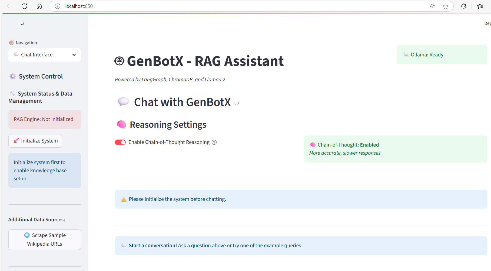
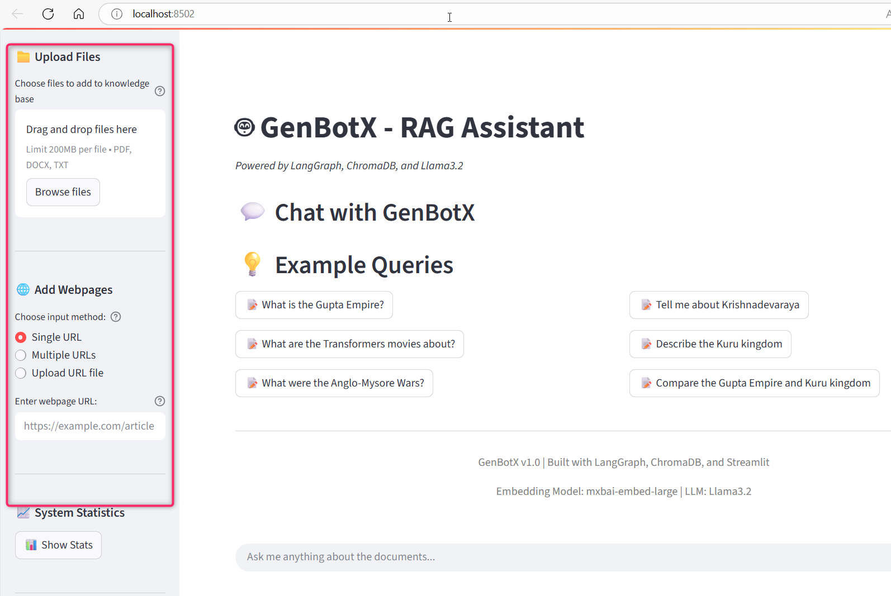
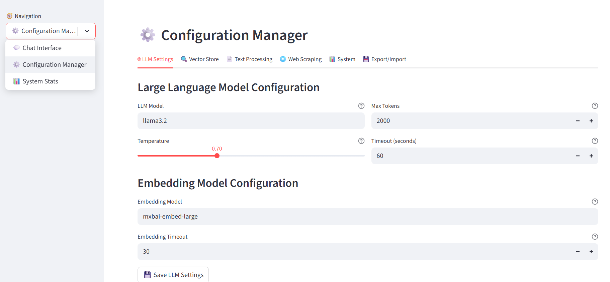
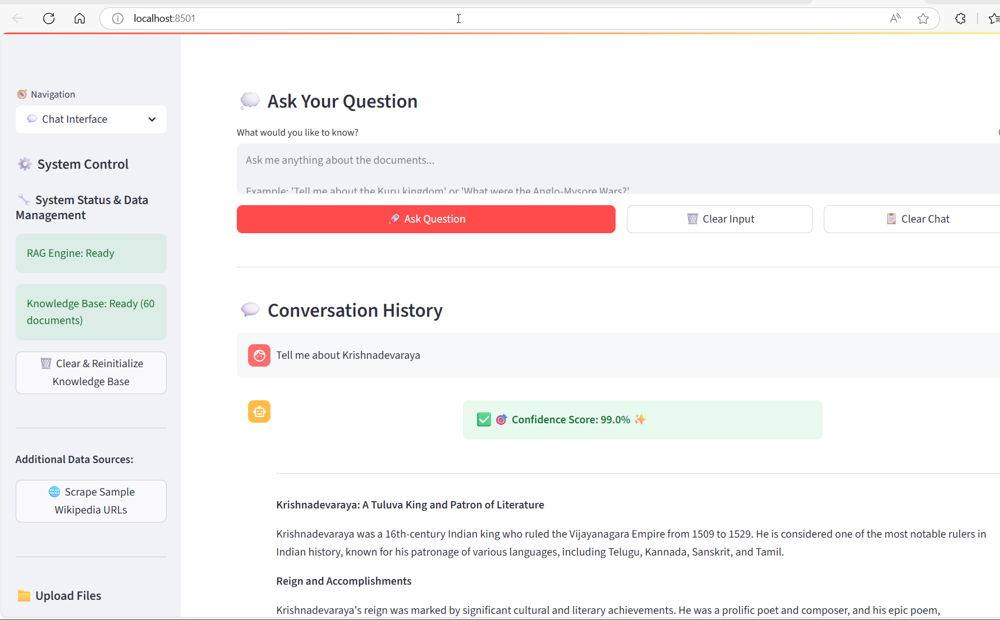
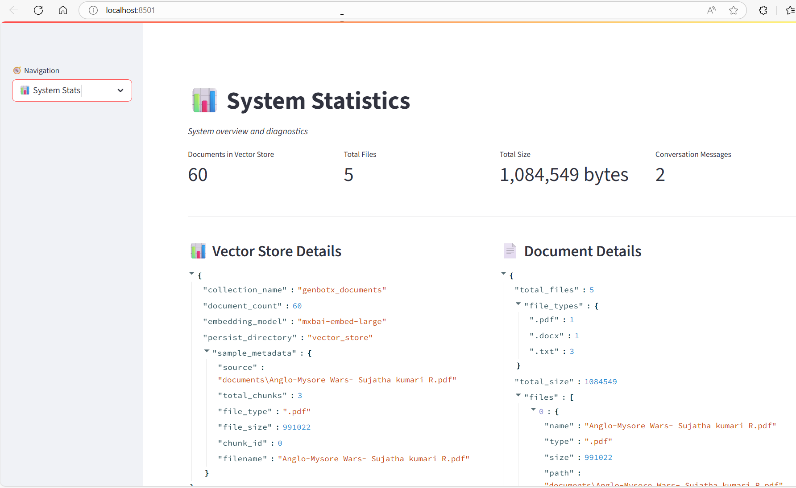

# GenBotX - RAG Document Assistant

**GenBotX** is an intelligent Retrieval-Augmented Generation (RAG) system designed to provide accurate answers from your custom documents and web content. Built with cutting-edge technologies including LangGraph, ChromaDB, and Llama3.2, GenBotX transforms how you interact with your knowledge base.

## 🎯 Core Purpose and Objectives

GenBotX addresses the critical challenge of **information retrieval and knowledge management** in organizations and research environments. Our system enables users to:

- **Centralize Knowledge**: Upload and manage documents from multiple sources (PDFs, DOCX, TXT, web pages)
- **Intelligent Search**: Query your knowledge base using natural language with context-aware responses
- **Multi-Source Integration**: Seamlessly combine local documents with web-scraped content
- **Real-time Processing**: Get immediate answers with transparent reasoning chains
- **Scalable Architecture**: Handle growing document collections with persistent vector storage



## Features

### Core RAG Capabilities
- **RAG Pipeline**: LangGraph workflow for document retrieval and answer generation
- **Multi-format Support**: PDF, DOCX, and TXT files
- **Vector Store**: ChromaDB with mxbai-embed-large embeddings
- **Session Memory**: Maintains conversation context
- **Chain-of-Thought**: Shows reasoning steps

### File Management
- **File Upload**: Upload documents through web interface
- **Web Scraping**: Add webpage content to knowledge base
- **Duplicate Detection**: Prevents processing identical content
- **Content Management**: Track all uploaded and scraped content



### Configuration Management
- **YAML Configuration**: External configuration file
- **Web UI**: Configure settings through Streamlit interface
- **Live Updates**: Apply changes without restart
- **Validation**: Automatic parameter checking



## Prerequisites

1. **Python 3.12+**
2. **Ollama** with models:
   - `llama3.2` (LLM)
   - `mxbai-embed-large` (embeddings)

Install Ollama models:
```bash
ollama pull llama3.2
ollama pull mxbai-embed-large
```

## 🚀 Quick Start Guide

### Option 1: Automated Installation (Recommended)

**One-Command Setup:**
```bash
# Clone and run automated installer
git clone https://github.com/VeereshGowda/genbotx-rag-assistant.git
cd genbotx-rag-assistant
python install.py
```

The automated installer will:
- Check system requirements and dependencies
- Install Python packages and Ollama models
- Create necessary directories and configuration files
- Initialize the system and vector store
- Provide clear next steps for launching the application

### Option 2: Manual Installation

**Step 1: Prerequisites Setup**

**Required Software:**
- Python 3.12 or higher
- [Ollama](https://ollama.ai/) installed and running

**Install Ollama Models:**
```bash
# Install required models
ollama pull llama3.2
ollama pull mxbai-embed-large

# Verify installation
ollama list
```

**Step 2: Installation**

**Clone and Setup:**
```bash
# Clone the repository
git clone https://github.com/VeereshGowda/genbotx-rag-assistant.git
cd genbotx-rag-assistant

# Create virtual environment (recommended)
python -m venv .venv

# Activate virtual environment
# Windows:
.\.venv\Scripts\activate
# Linux/Mac:
source .venv/bin/activate

# Install dependencies
pip install -e .
```

**Environment Configuration:**
```bash
# Copy environment template
cp .env.example .env

# Edit .env file with your settings (optional - defaults work for local setup)
# nano .env  # or use your preferred editor
```

**Step 3: Initialize System**

```bash
# Test configuration
python test_config.py

# Initialize knowledge base and vector store
python setup.py
```

**Step 4: Launch Application**

**Web Interface (Recommended):**
```bash
streamlit run app.py
```

**Command Line Interface:**
```bash
python main.py
```

Access the web interface at: `http://localhost:8501`



## Project Structure

```
GenBotX/
├── src/
│   ├── __init__.py
│   ├── rag_engine.py           # LangGraph RAG pipeline
│   ├── vector_store_manager.py # ChromaDB operations
│   ├── document_processor.py   # Document processing and chunking
│   ├── content_manager.py      # File upload & web scraping
│   ├── wikipedia_scraper.py    # Wikipedia data extraction
│   ├── config.py              # Configuration management
│   └── config_ui.py           # Configuration web interface
├── documents/                  # Document storage
│   ├── Anglo-Mysore Wars- Sujatha kumari R.pdf
│   ├── Krishnadevaraya_Wikipedia.docx
│   └── wikipedia_urls.txt
├── uploads/                    # User uploaded files
├── vector_store/              # ChromaDB persistence
├── logs/                      # Application logs
├── images/                    # UI screenshots
├── config.yaml               # Main configuration file
├── app.py                     # Streamlit web application
├── main.py                    # CLI interface
├── setup.py                   # System initialization
├── test_config.py             # Configuration testing
├── CONFIGURATION_SUMMARY.md   # Configuration documentation
└── README.md
```

## Quick Start

### 1. Initialize System
```bash
python test_config.py  # Test configuration
python setup.py        # Initialize knowledge base
```

### 2. Launch Application
```bash
streamlit run app.py
```

The application includes:
- **Chat Interface**: Main Q&A interface
- **Configuration Manager**: Web-based settings management
- **System Stats**: Performance metrics



### 3. CLI Interface
```bash
python main.py
```

## 📖 Using GenBotX

### Document Upload and Management

**Supported File Types:**
GenBotX processes multiple document formats with optimized extraction techniques for each type:

- **PDF Files**: Advanced text extraction preserving document structure and metadata
- **DOCX Documents**: Full content extraction including headers, formatting, and embedded elements  
- **Text Files**: Direct processing with encoding detection and content validation

**Upload Process:**
1. Access the Streamlit web interface at `http://localhost:8501`
2. Navigate to the "Upload Files" section in the sidebar
3. Select single or multiple files using the file picker
4. Click "Process Uploaded Files" to add documents to your knowledge base
5. Monitor processing progress through real-time status updates

**Content Verification:**
The system automatically detects and prevents duplicate content using advanced hashing algorithms. Each uploaded document is validated for format compatibility and content integrity before processing.

### Web Content Integration

**URL-Based Content Addition:**
GenBotX can extract and process content directly from web pages, expanding your knowledge base with dynamic online content:

1. Use the "Add Webpages" section in the sidebar
2. Enter single URLs or multiple URLs (one per line)
3. Click "Scrape and Add Webpages" to initiate content extraction
4. Review extraction summary and content validation results

**Intelligent Content Extraction:**
The web scraping module employs sophisticated algorithms to identify main content areas while filtering out navigation elements, advertisements, and other non-essential page components. This ensures high-quality content addition to your knowledge base.

### Querying Your Knowledge Base

**Natural Language Interaction:**
GenBotX enables sophisticated querying through natural language input. The system understands context, intent, and complex relationships within your document collection.

**Example Query Types:**

*Historical Analysis:*
"What were the main causes and consequences of the Anglo-Mysore Wars, and how did they impact regional politics?"

*Comparative Research:*
"Compare the leadership styles and achievements of Krishnadevaraya with other rulers of his era."

*Technical Information:*
"Explain the narrative structure and themes of the Transformers film series across different releases."

*Cross-Document Synthesis:*
"What connections exist between the Kuru Kingdom's political structure and later South Indian dynasties?"

**Response Features:**
- Contextually relevant answers with source attribution
- Chain-of-thought reasoning display showing the system's analytical process
- Direct links to source documents for verification and deeper exploration
- Conversation memory maintaining context across multiple queries


### Configuration Management

**Web-Based Configuration Interface:**
Access comprehensive system settings through the integrated configuration manager:

1. Navigate to the "Configuration" page in the web interface
2. Modify parameters across different system components
3. Apply changes in real-time without system restart
4. Export and import configuration profiles for different use cases

**Key Configuration Areas:**

*Language Model Settings:* Temperature, token limits, and response generation parameters
*Vector Store Configuration:* Similarity thresholds, search parameters, and indexing options  
*Document Processing:* Chunk sizes, overlap settings, and format-specific options
*Content Management:* Upload limits, storage paths, and content validation settings

### Advanced Features

**Session Management:**
GenBotX maintains conversation context across queries, enabling complex multi-turn interactions and follow-up questions that build upon previous responses.

**Performance Monitoring:**
Built-in performance metrics provide insights into system operation, including query response times, document processing statistics, and resource utilization patterns.

**Content Analytics:**
Track which documents are most frequently accessed, identify knowledge gaps, and understand user query patterns to optimize your knowledge base organization.

## Example Queries

- "What is the Gupta Empire?"
- "Tell me about Krishnadevaraya" 
- "What are the Transformers movies about?"
- "Describe the Anglo-Mysore Wars"

## Technical Architecture

### RAG Pipeline
1. **Query Analysis**: Extract key information from user questions
2. **Document Retrieval**: Semantic search using ChromaDB
3. **Context Formation**: Combine relevant document chunks
4. **Response Generation**: Generate answers using Llama3.2
5. **Quality Check**: Confidence scoring and validation

### Components
- **Vector Store**: ChromaDB with mxbai-embed-large embeddings
- **LLM**: Ollama Llama3.2 for response generation
- **Memory**: Conversation context tracking
- **Content Manager**: File upload and web scraping
- **Configuration**: YAML-based external configuration

## Configuration

The system uses `config.yaml` for all settings. Key parameters:

```yaml
llm:
  model: "llama3.2"
  temperature: 0.7
  max_tokens: 2000

vector_store:
  similarity_search_k: 5
  similarity_threshold: 0.7

text_splitter:
  chunk_size: 1000
  chunk_overlap: 200
```

Access the Configuration Manager through the web interface for easy management.

## Testing

```bash
python test_config.py  # Test configuration system
```

## Performance Metrics
- **Document Processing**: ~1000 docs/minute
- **Query Response**: ~2-5 seconds
- **Memory Usage**: ~500MB + documents
- **Vector Store**: Scales to 100k+ documents
